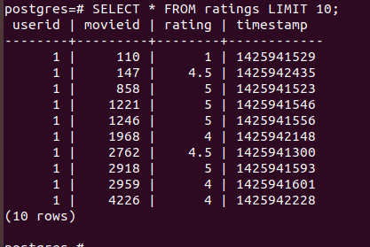
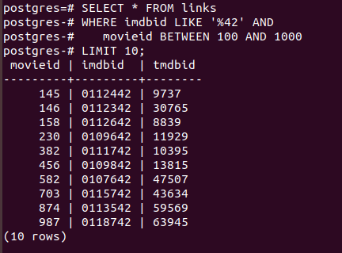
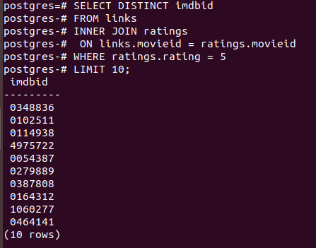
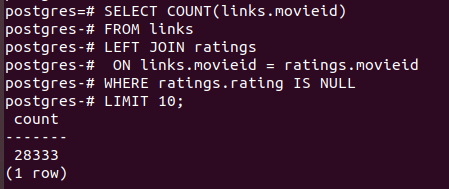
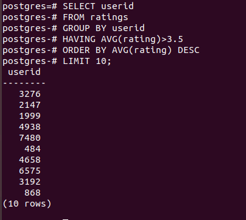
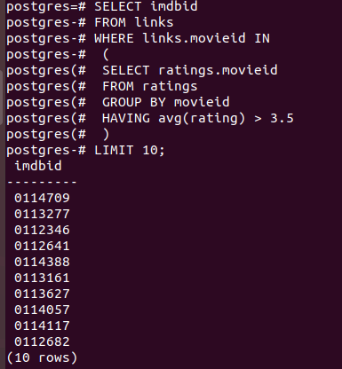
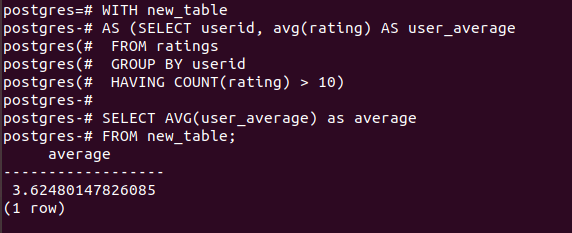

1. Простые выборки 
1.1 SELECT, LIMIT - выбрать 10 записей из таблицы rating 

<pre>
SELECT * FROM ratings LIMIT 10;
</pre>

  

1.2 WHERE, LIKE - выбрать из таблицы links всё записи, у которых imdbid оканчивается на "42", а поле movieid между 100 и 1000
<pre>
SELECT * FROM links 
WHERE imdbid LIKE '%42' AND
	  movieid BETWEEN 100 AND 1000
LIMIT 10;
</pre>

  

2. Сложные выборки: JOIN 
2.1 INNER JOIN выбрать из таблицы links все imdb_id, которым ставили рейтинг 5
<pre>
SELECT DISTINCT imdbid 			-- distinct можно было не использовать
FROM links 
INNER JOIN ratings
	ON links.movieid = ratings.movieid
WHERE ratings.rating = 5
LIMIT 10;
</pre>

  

3. Аггрегация данных: базовые статистики
3.1 COUNT() Посчитать число фильмов без оценок
<pre>
SELECT COUNT(links.movieid)
FROM links
LEFT JOIN ratings
	ON links.movieid = ratings.movieid 
WHERE ratings.rating IS NULL
LIMIT 10;
</pre>

  

3.2 GROUP BY, HAVING вывести top-10 пользователей, у который средний рейтинг выше 3.5
<pre>
SELECT userid
FROM ratings
GROUP BY userid
HAVING AVG(rating)>3.5
ORDER BY AVG(rating) DESC
LIMIT 10;
</pre>

  

4. Иерархические запросы
4.1 Подзапросы: достать 10 imbdId из links у которых средний рейтинг больше 3.5
<pre>
SELECT imdbid
FROM links
WHERE links.movieid IN 
	(
	SELECT ratings.movieid
	FROM ratings
	GROUP BY movieid
	HAVING avg(rating) > 3.5
	)
LIMIT 10;
</pre>
  

4.2 Common Table Expressions: посчитать средний рейтинг по пользователям, у которых более 10 оценок
<pre>
WITH new_table
AS	(SELECT userid, avg(rating) AS user_average
	FROM ratings
	GROUP BY userid
	HAVING COUNT(rating) > 10)
	
SELECT AVG(user_average) as average
FROM new_table;
</pre>

