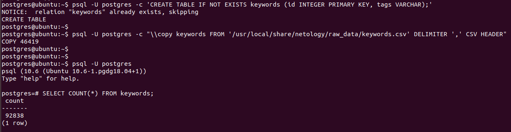
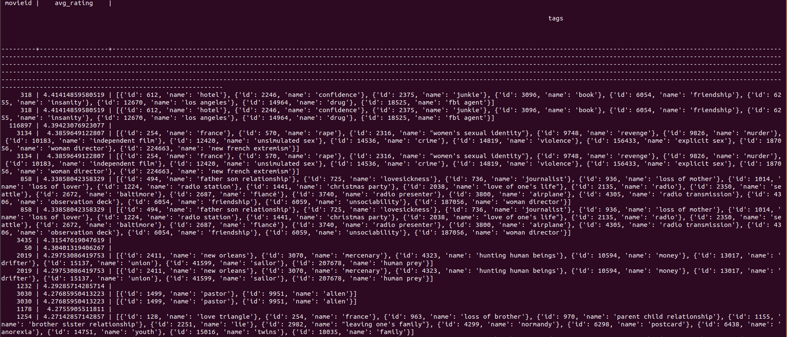
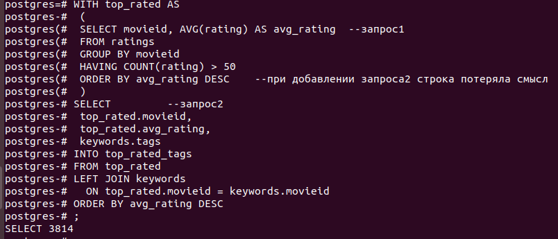

<b>Оконные функции.</b> 
Вывести список пользователей в формате userId, movieId, normed_rating, avg_rating где  
userId, movieId - без изменения 
normed_rating=(r - r_min)/(r_max - r_min), где r_min и r_max соответственно минимально и максимальное значение рейтинга у данного пользователя 
avg_rating - среднее значение рейтинга у данного пользователя 
Вывести первые 30 таких записей 

<pre>
SELECT 	userId, 
	movieId, 
	((rating - MIN(rating) OVER (PARTITION BY userId)) / (MAX(rating) OVER (PARTITION BY userId) - MIN(rating) OVER (PARTITION BY userId)))  AS normed_rating, 
	AVG(rating) OVER (PARTITION BY userId) avg_rating 
FROM ratings 
LIMIT 30;
</pre>

  

<b>ETL</b> 
Extract 
<pre>
psql -U postgres -c 'CREATE TABLE IF NOT EXISTS keywords (id INTEGER PRIMARY KEY, tags VARCHAR);'
</pre>
<pre>
psql -U postgres -c "\\copy keywords FROM '/usr/local/share/netology/raw_data/keywords.csv' DELIMITER ',' CSV HEADER"
</pre>
<pre>
psql -U postgres
</pre>
<pre>
SELECT COUNT(*) FROM keywords;
</pre>

  

Transform 
<pre>
WITH top_rated AS
	(
	SELECT movieid, AVG(rating) AS avg_rating		--запрос1
	FROM	ratings
	GROUP BY movieid
	HAVING	COUNT(rating) > 50
	ORDER BY avg_rating DESC				--при добавлении запроса2 строка потеряла смысл
	)
SELECT 								--запрос2
	top_rated.movieid, 
	top_rated.avg_rating, 
	keywords.tags					
FROM top_rated 
LEFT JOIN keywords
		ON top_rated.movieid = keywords.movieid
ORDER BY avg_rating DESC
LIMIT 150;	
</pre>

  

Load 
<pre>

</pre>

  

