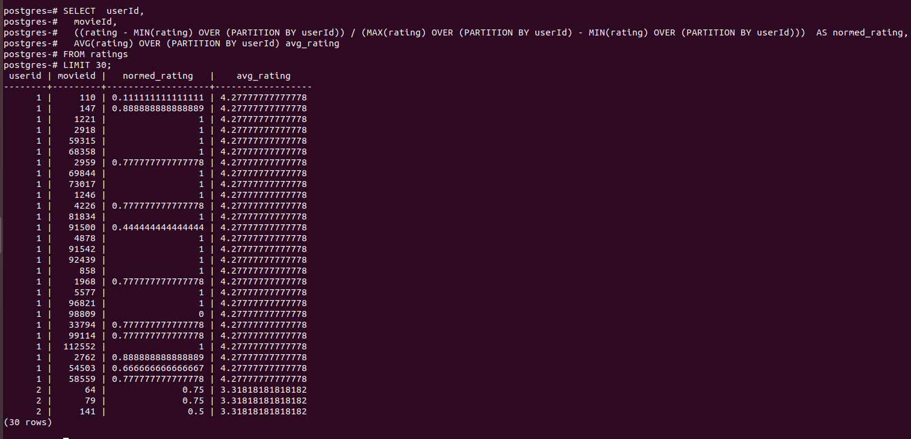

<b>Оконные функции.</b> 
Вывести список пользователей в формате userId, movieId, normed_rating, avg_rating где  
userId, movieId - без изменения 
normed_rating=(r - r_min)/(r_max - r_min), где r_min и r_max соответственно минимально и максимальное значение рейтинга у данного пользователя 
avg_rating - среднее значение рейтинга у данного пользователя 
Вывести первые 30 таких записей 

<pre>
SELECT 	userId, 
	movieId, 
	((rating - MIN(rating) OVER (PARTITION BY userId)) / (MAX(rating) OVER (PARTITION BY userId) - MIN(rating) OVER (PARTITION BY userId)))  AS normed_rating, 
	AVG(rating) OVER (PARTITION BY userId) avg_rating 
FROM ratings 
LIMIT 30;
</pre>

  

<b>ETL</b> 
Extract 
<pre>
psql -U postgres -c 'CREATE TABLE IF NOT EXISTS keywords (id INTEGER PRIMARY KEY, tags VARCHAR);'

psql -U postgres -c "\\copy keywords FROM '/usr/local/share/netology/raw_data/keywords.csv' DELIMITER ',' CSV HEADER"

psql -U postgres

SELECT COUNT(*) FROM keywords;
</pre>