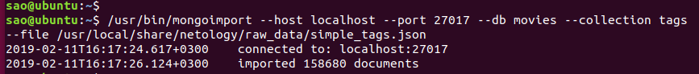
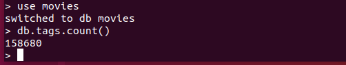
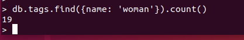
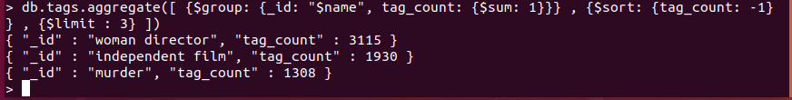

<b>Домашнее задание № 5. MongoDB.</b> 
1) подключиться к Mongo из командной строки Linux и загрузить в Mongo текстовый JSON-файл;

<pre>
/usr/bin/mongo localhost:27017
</pre>
<pre>
/usr/bin/mongoimport --host localhost --port 27017 --db movies --collection tags --file /usr/local/share/netology/raw_data/simple_tags.json
use movies
</pre>

  

2) выполнить запросы к Mongo через консоль: 
2.1) подсчитайте число элементов в созданной коллекции tags в bd movies

<pre>
db.tags.count()
</pre>

  

2.2) подсчитайте число фильмов с конкретным тегом - woman

<pre>
db.tags.find({name:'woman'}).count()
</pre>

  

2.3) используя группировку данных ($groupby) вывести top-3 самых распространённых тегов

<pre>
db.tags.aggregate([ {$group: {_id: "$name", tag_count: {$sum: 1}}} , {$sort: {tag_count: -1} } , {$limit : 3} ])
</pre>

  

