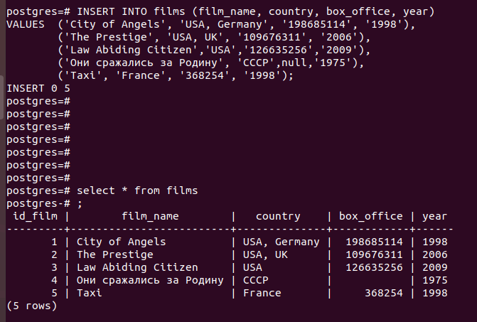

Проект базы данных: 

  
SQL-запрос для создания базы данных под это задание: 
<pre>
CREATE DATABASE homework1;
GRANT ALL PRIVILEGES ON DATABASE homework1 TO postgres;
</pre>
  
SQL-запрос для создания таблицы <b>films</b> 
<pre>
CREATE TABLE films (
    id_film     serial PRIMARY KEY,       -- первичный ключ, serial - числовой тип данных с автоувеличением
    film_name   VARCHAR (100) NOT NULL,   -- строка до 100 символов, не уникальный, не пустой
    country     VARCHAR (50) NOT NULL,    -- строка до 50 символов, не уник, не пустой
    box_office  VARCHAR (25),             -- строка из 25 символов
    year        INTEGER                   -- число
);
</pre>
  
SQL-запрос для создания таблицы <b>persons</b> 
<pre>
CREATE TABLE persons (
    id_person   serial PRIMARY KEY,       -- первичный ключ, serial - генерирует id
    person_name VARCHAR (20)[2] NOT NULL  -- массив из 2-ух строк до 20 символов, не пустой
);
</pre>
  
SQL-запрос для создания таблицы <b>persons_films</b> 
<pre>
CREATE TABLE persons_films (
    id_person   INTEGER REFERENCES persons(id_person),       -- PK and FK (persons)
    id_film     INTEGER REFERENCES films(id_film),           -- PK and FK (films)
    role        VARCHAR(25),                         -- строка до 25 символов
    PRIMARY KEY (id_person, id_film)                 -- составной первичный ключ
);
</pre>
  
Таблицы успешно созданы с посощью этих запросов.
Для вставки строк в таблицы применялся ряд запросов INSERT:

<pre>
INSERT INTO films (film_name, country, box_office, year)
VALUES  ('City of Angels', 'USA, Germany', '$198 685 114', '1998'),
        ('The Prestige', 'USA, UK', '$109 676 311', '2006'),
        ('Law Abiding Citizen','USA','$126 635 256','2009'),
        ('Они сражались за Родину', 'СССР','','1975'),
        ('Taxi', 'France', '$368 254', '1998');
</pre>
Проверка: 

<pre>
INSERT INTO persons (person_name)
VALUES  ('{"Seale","John"}'),           --оператор Город Ангелов
        ('{"Silberling","Brad"}'),      -- режиссер ГА
        ('{"Cage","Nicolas"}'),         --актер ГА
        ('{"Ryan","Meg"}'),             --актер ГА
        ('{"Nolan","Christopher"}'),    --режисер Престиж
        ('{"Jackman","Hugh"}'),         --актер П
        ('{"Caine","Michael"}'),        --актер П
        ('{"Gray","F. Gary"}'),         --режиссер ЗакГражданин
        ('{"Бондарчук","Сергей"}'),     --режисер И АКТЕР Они сражались
        ('{"Шукшин","Василий"}'),       --актер
        ('{"Naceri","Samy"}')           --Актер Такси
 ;         
</pre>
Проверка 1: 
 
Проверка 2:  
 
