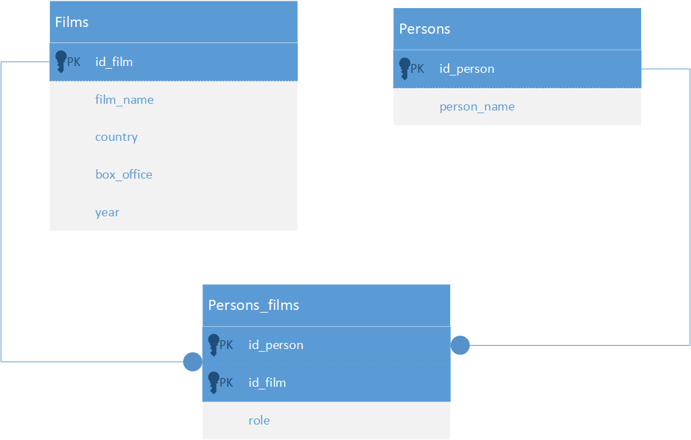
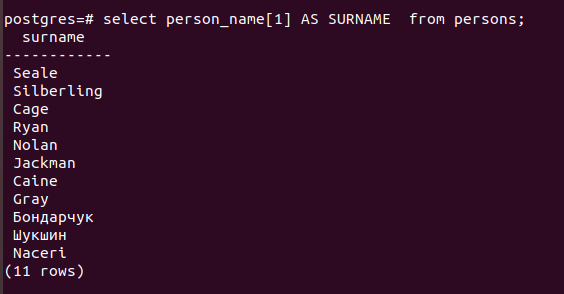

Проект базы данных: 

  
SQL-запрос для создания таблицы <b>films</b> 
<pre>
CREATE TABLE films (
    id_film     serial PRIMARY KEY,       -- первичный ключ, serial - числовой тип данных с автоувеличением
    film_name   VARCHAR (100) NOT NULL,   -- строка до 100 символов, не уникальный, не пустой
    country     VARCHAR (50) NOT NULL,    -- строка до 50 символов, не уник, не пустой
    box_office  INTEGER,                  -- число
    year        INTEGER                   -- число
);
</pre>
  
SQL-запрос для создания таблицы <b>persons</b> 
<pre>
CREATE TABLE persons (
    id_person   serial PRIMARY KEY,       -- первичный ключ, serial - числовой тип данных с автоувеличением
    person_name VARCHAR (20)[2] NOT NULL  -- массив из 2-ух строк до 20 символов, не пустой
);
</pre>
  
SQL-запрос для создания таблицы <b>persons_films</b> 
<pre>
CREATE TABLE persons_films (
    id_person   INTEGER REFERENCES persons(id_person),       -- PK and FK (persons)
    id_film     INTEGER REFERENCES films(id_film),           -- PK and FK (films)
    role        VARCHAR(25),                         -- строка до 25 символов
    PRIMARY KEY (id_person, id_film)                 -- составной первичный ключ
);
</pre>
  
Таблицы успешно созданы с посощью этих запросов.
Для вставки строк в таблицы применялся ряд запросов INSERT:

<pre>
INSERT INTO films (film_name, country, box_office, year)
VALUES  ('City of Angels', 'USA, Germany', '198685114', '1998'),
        ('The Prestige', 'USA, UK', '109676311', '2006'),
        ('Law Abiding Citizen','USA','126635256','2009'),
        ('Они сражались за Родину', 'СССР','','1975'),
        ('Taxi', 'France', '368254', '1998');
</pre>
Проверка: 

<pre>
INSERT INTO persons (person_name)
VALUES  ('{"Seale","John"}'),           --оператор Город Ангелов
        ('{"Silberling","Brad"}'),      -- режиссер ГА
        ('{"Cage","Nicolas"}'),         --актер ГА
        ('{"Ryan","Meg"}'),             --актер ГА
        ('{"Nolan","Christopher"}'),    --режисер Престиж
        ('{"Jackman","Hugh"}'),         --актер П
        ('{"Caine","Michael"}'),        --актер П
        ('{"Gray","F. Gary"}'),         --режиссер ЗакГражданин
        ('{"Бондарчук","Сергей"}'),     --режисер И АКТЕР Они сражались
        ('{"Шукшин","Василий"}'),       --актер
        ('{"Naceri","Samy"}')           --Актер Такси
 ;         
</pre>
Проверка 1: 
 
Проверка 2 (выведем только фамилии):  
 
  
На этапе формирования третьего запроса INSERT стало понятно, что не совсем корректно выбран PRIMARY KEY в таблице persons_films, так как Сергей Бондарчук имеет несколько ролей в фильме "Они сражались за Родину" и должен иметь две записи в этой таблице.  
Придется сначла удалить таблицу, добавить снова с верным PK и только потом внести данные.  
Хотя было бы более корректным создать таблицу roles и связать ее подобно существующим с таблицей persons_films.
<pre>
DROP TABLE persons_films;

CREATE TABLE persons_films (
    id_person   INTEGER REFERENCES persons(id_person),       -- PK and FK (persons)
    id_film     INTEGER REFERENCES films(id_film),           -- PK and FK (films)
    role        VARCHAR(25),                                 -- строка до 25 символов
    PRIMARY KEY (id_person, id_film, role)                     -- составной первичный ключ
);

INSERT INTO persons_films (id_person, id_film. role)
VALUES  (1, 1, 'оператор'),
        (2, 1, 'режиссер'),
        (3, 1, 'актер'),
        (4, 1, 'актер'),
        (5, 2, 'режиссер'),
        (6, 2, 'актер'),
        (7, 2, 'актер'),
        (8, 3, 'режиссер'),
        (9, 4, 'режиссер'),
        (9, 4, 'актер'),
        (10, 4, 'актер'),
        (11, 5, 'актер')
;
</pre>

База данных изменилась так:  

  
Несколько примерой SQL запросов на получившейся БД:
