<h1><b>Проектная работа по модулю “SQL и получение данных”</b></h1> 

<b>Что необходимо сделать? 
1) Подготовить базу данных PostgreSQL для работы одним из вариантов: 
* Развернуть с помощью виртуальной машины/vagrant/docker или другим удобным способом 
* Использовать сервис https://www.db-fiddle.com для работы через браузер  
2) Создать не менее 4 таблиц и заполнить их данными. Таблицы должны быть связаны между собой посредством ключей (ID) и представлять какую-то логическую структуру. Тематика данных может быть использована любая. 
3) Написать не менее 10 SQL запросов к базе данных. В запросах должны быть отражены как базовые команды, так и аналитические функции (не менее 3 запросов). Должно присутствовать описание того, что вы получаете путем каждого запроса. 
</b>
 
   

1. Подготовка БД. 
Структура БД: 
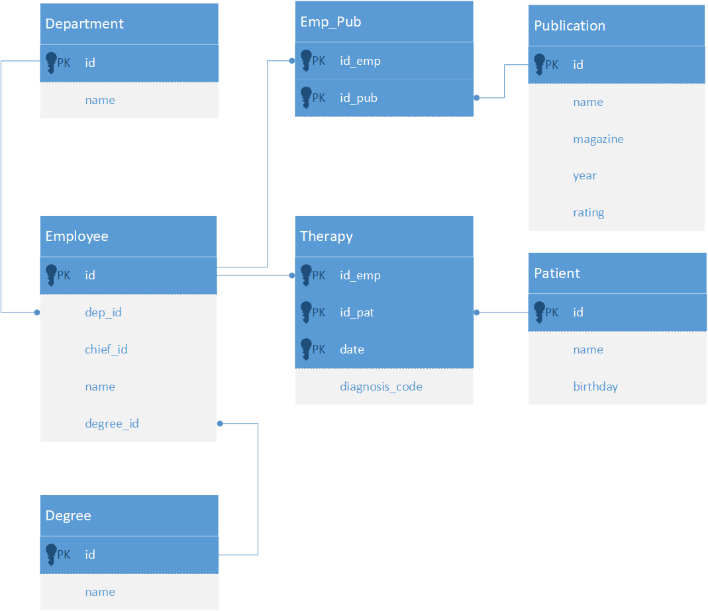 
БД разворачивалась на виртуальной машине. 
Предметная область такая же, как и в лабораторной работе. Была доавлена таблица с Публикациями, таблица соответсвия, какой сотрудник является автором/соавтором какой публикации (Emp_Pub). Также таблица с Пациентами и таблица Терапия, где отражается, какой пациент к какому врачу когда приходил на прием. Так же у сотрудников появился новый атрибут - наличие ученой степени и соответствующая таблица с учеными степенями.
 Форматы атрибутов приведены в коде создания таблиц.

   

2. Создание таблиц и их заполнение. 
SQL-команды на создание таблиц: 
<pre>
CREATE TABLE IF NOT EXISTS Department 
(
id integer PRIMARY KEY,
name varchar(100)
);

    
CREATE TABLE IF NOT EXISTS Degree
 	(
      id integer PRIMARY KEY,
      name varchar(50)
    );

CREATE TABLE IF NOT EXISTS Employee 
 	(
      id integer PRIMARY KEY,
      dep_id integer REFERENCES Department(id),
      chief_id integer,
      name varchar(50),
      degree_id integer REFERENCES Degree(id)
    );
   
CREATE TABLE IF NOT EXISTS Publication 
 	(
      id integer PRIMARY KEY,
      name varchar(250),
      magazine varchar(100),
      year integer,
	  rating real
    );

CREATE TABLE IF NOT EXISTS Patient 
 	(
      id integer PRIMARY KEY,
      name varchar(30),
	  surname varchar(30),
      birthday date
    );
    
CREATE TABLE IF NOT EXISTS Emp_Pub 
 	(
      id_emp integer REFERENCES Employee(id),
      id_pub integer REFERENCES Publication(id),
      PRIMARY KEY (id_emp, id_pub)                
    );

CREATE TABLE IF NOT EXISTS Therapy 
 	(
      id_pat integer REFERENCES Patient(id),
      id_emp integer REFERENCES Employee(id),
      date date,
      diagnosis_code varchar(10),
      PRIMARY KEY (id_pat, id_emp, date)                 
    );
</pre>

   

Команды для заполнения БД через командную строку из файлов csv : 

<pre>
psql -U postgres -c "\\copy Department FROM '/usr/local/share/netology/itog/Department.csv' DELIMITER ';' CSV HEADER"
psql -U postgres -c "\\copy Degree FROM '/usr/local/share/netology/itog/Degree.csv' DELIMITER ';' CSV HEADER"
psql -U postgres -c "\\copy Emp_Pub FROM '/usr/local/share/netology/itog/Emp_Pub.csv' DELIMITER ';' CSV HEADER"
psql -U postgres -c "\\copy Employee FROM '/usr/local/share/netology/itog/Employee.csv' DELIMITER ';' CSV HEADER"
psql -U postgres -c "\\copy Patient FROM '/usr/local/share/netology/itog/Patient.csv' DELIMITER ';' CSV HEADER"
psql -U postgres -c "\\copy Publication FROM '/usr/local/share/netology/itog/Publication.csv' DELIMITER ';' CSV HEADER"
psql -U postgres -c "\\copy Therapy FROM '/usr/local/share/netology/itog/Therapy.csv' DELIMITER ';' CSV HEADER"
</pre>
   

3. SQL-запросы и их результаты. 
<pre>
--1-- Вывести список пациентов, обращавшихся к врачу более 15 раз (id, имя, фамилию, дату рождения и кол-во раз обращений)

SELECT 	Patient.id,
		Patient.name,
		Patient.surname,
		Patient.birthday,
		COUNT(Therapy.id_emp)
FROM Patient INNER JOIN Therapy
	ON Patient.id = Therapy.id_pat
GROUP BY Patient.id
HAVING COUNT(Therapy.id_emp) > 15
;
</pre>
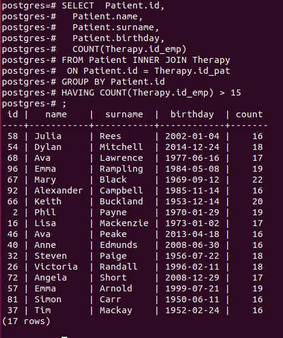
  
<pre>
--2 Вывести список сотрудников-докторов наук (id, имя, название департамента, степень), вывести по департаментам (сортировка в списке)
SELECT 	Employee.id,
		Employee.name,
		Department.name,
		Degree.name
FROM Employee INNER JOIN Department
	ON Employee.dep_id = Department.id
		INNER JOIN Degree 
			ON Employee.degree_id = Degree.id
WHERE Degree.name LIKE 'Doctor%'
ORDER BY Department.name
;
</pre>
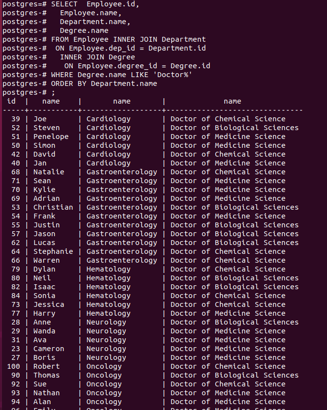 
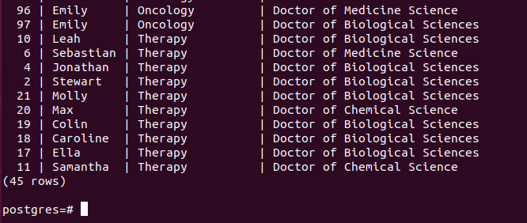
  
<pre>
--3-- Вывести топ-15 сотрудников-докторов наук по среднему рейтингу их публикаций (id, имя, департамент, степень, средний рейтинг публикаций)

WITH Ratings AS
	(
		SELECT 	DISTINCT Emp_Pub.id_emp,
				AVG (Publication.rating) OVER (PARTITION BY id_emp) as Average
		FROM Emp_Pub INNER JOIN Publication
			ON Emp_pub.id_pub = Publication.id
	)
SELECT Employee.id AS id,
			Employee.name,
			Department.name,
			Degree.name,
			Ratings.Average
      FROM Employee INNER JOIN Department
		ON Employee.dep_id = Department.id
			INNER JOIN Degree 
				ON Employee.degree_id = Degree.id
					INNER JOIN Ratings 
						ON Employee.id = Ratings.id_emp
	  WHERE Degree.name LIKE 'Doctor%'
	  ORDER by Ratings.Average DESC
	  LIMIT 15
;
</pre>
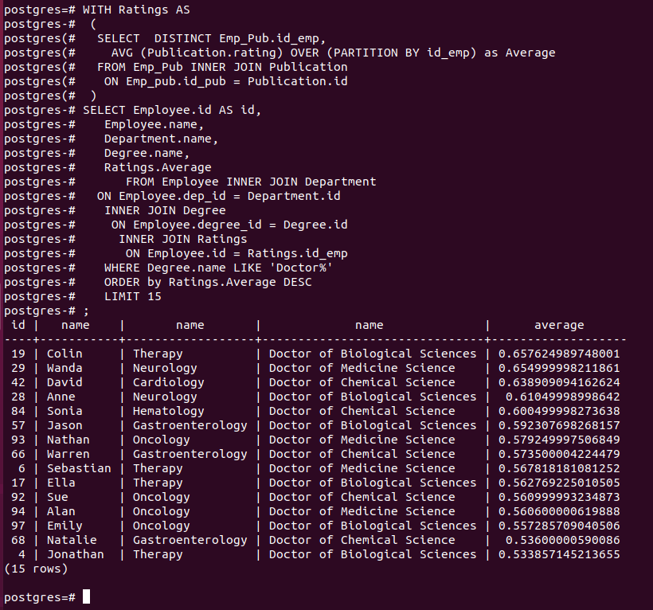
  
<pre>
--4--  Вывести данные, сколько сотрудник написал статей по годам (id сотрудника, имя сотрудника, год публикации, кол-во публикаций в этом году), упорядочить по id сотрудника

SELECT 	DISTINCT Emp_Pub.id_emp,
		Employee.name,
		Publication.year,
		COUNT(Emp_pub.id_pub) OVER (PARTITION BY id_emp, year)
FROM Emp_Pub INNER JOIN Publication
	ON Emp_pub.id_pub = Publication.id
		INNER JOIN Employee 
			ON Emp_Pub.id_emp = Employee.id
ORDER BY Emploee.id
;
</pre>
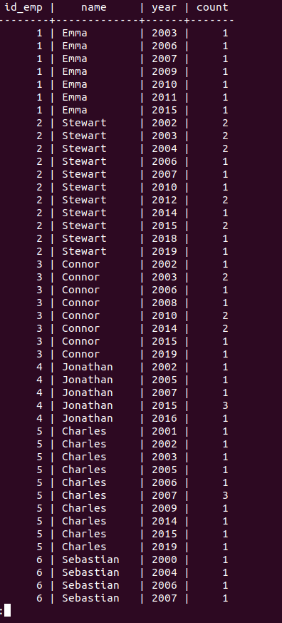
  
<pre>
--5-- Вывести сотрудников отделения гастроэнтерологии, не написавших ни одной публикации в 2018 году (id, имя)

WITH Pub2018 AS
	(
	SELECT 	DISTINCT Emp_Pub.id_emp,
			Publication.year,
			COUNT(Emp_pub.id_pub) OVER (PARTITION BY id_emp, year)
	FROM Emp_Pub INNER JOIN Publication
		ON Emp_pub.id_pub = Publication.id
	WHERE year = 2018
	)
SELECT  Employee.id,
		Employee.name
FROM Employee INNER JOIN Department
	ON Employee.dep_id = Department.id
		LEFT JOIN Pub2018
			ON Employee.id = Pub2018.id_emp

WHERE 	id_emp IS NULL AND
		Department.name LIKE 'Gastro%'
;
</pre>
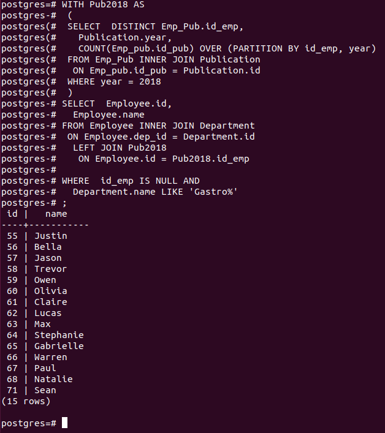
  
<pre>
--6-- Вывести, сколько принял больных за время работы каждый врач (id сотрудника, имя сотрудника, отделение, кол-во приемов), сортировать по id сотрудника

SELECT  DISTINCT Employee.id,
		Employee.name,
		Department.name,
		COUNT(Therapy.id_pat) OVER (PARTITION BY Therapy.id_emp)
FROM Employee INNER JOIN Therapy
	ON Employee.id = Therapy.id_emp
		INNER JOIN Department
			ON Employee.dep_id = Department.id
ORDER BY Employee.id
;
</pre>
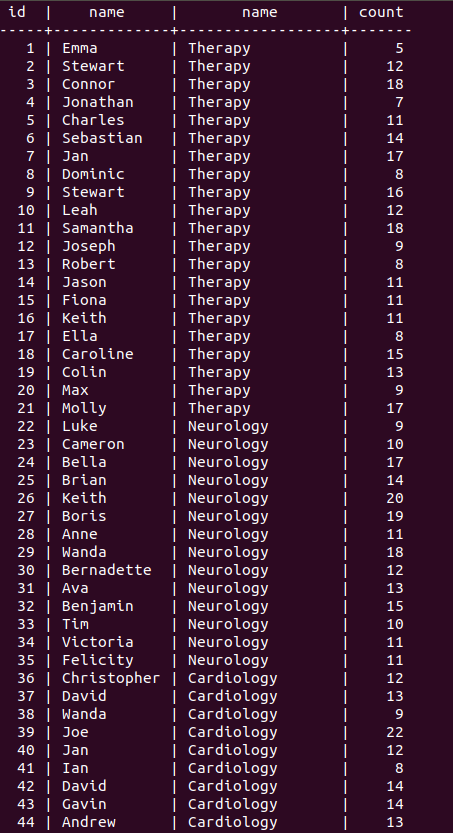
  
<pre>
--7-- Вывести список пациентов и дату их последнего визита (id, имя, фамилию и последнюю дату визита)

SELECT  DISTINCT Patient.id,
		Patient.name,
		Patient.surname,
		MAX(Therapy.date) OVER (PARTITION BY Therapy.id_pat) AS LastDate
FROM Patient LEFT JOIN Therapy
	ON Patient.id = Therapy.id_pat
ORDER BY LastDate DESC
;
</pre>
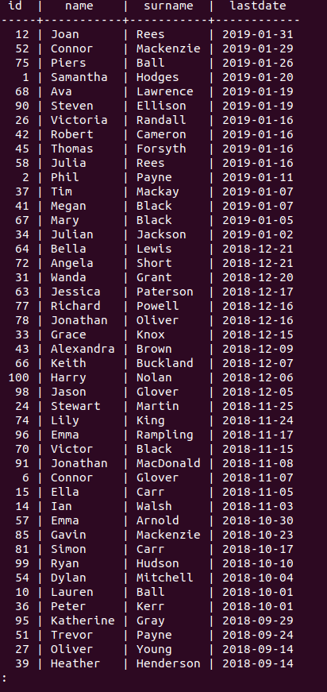
  
<pre>
--8-- Вывести список публикаций, в которых не более 8 соавторов (id, имя публикации, журнал, год, рейтинг и число авторов)

SELECT 	DISTINCT Publication.id,
		
		Publication.name,
		Publication.magazine,
		Publication.year,
		Publication.rating,
		COUNT(id_emp)
FROM Emp_Pub INNER JOIN Publication
	ON Emp_Pub.id_pub = Publication.id
GROUP BY Publication.id
HAVING COUNT(id_emp) < 8
;
</pre>
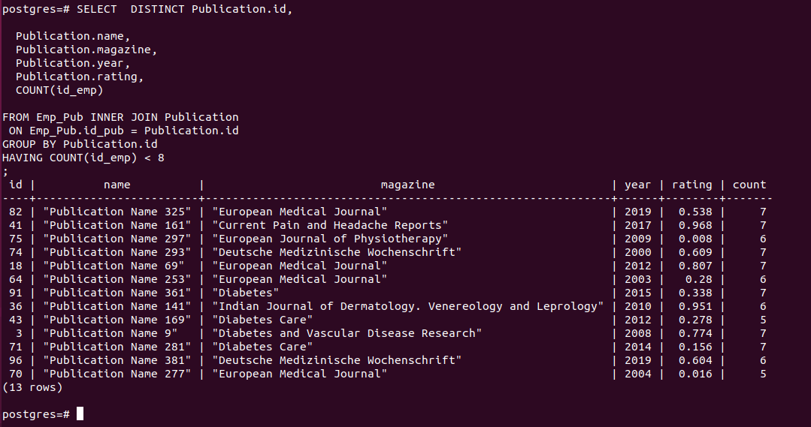
  
<pre>
--9-- Вывести топ-15 сотрудников, принявших более всего пациентов в 2018 году (id, имя врача, название департамента, количество приемов в 2018 году)

WITH Count_table AS
	(
    SELECT  DISTINCT Employee.id,
			COUNT(Therapy.id_pat) OVER (PARTITION BY Therapy.id_emp, Employee.dep_id) AS ValuePerYear
	FROM Employee INNER JOIN Therapy
		ON Employee.id = Therapy.id_emp
	)

SELECT	Employee.id,
		Employee.name,
		Department.name,
		Count_table.ValuePerYear
FROM Employee INNER JOIN Count_table
	ON Employee.id = Count_table.id
		INNER JOIN Department
			ON Employee.dep_id = Department.id
ORDER BY ValuePerYear DESC
LIMIT 15
;
</pre>
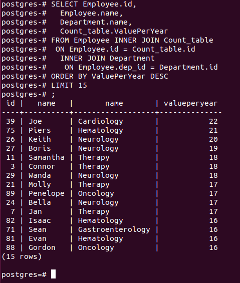
  
<pre>
--10-- Вывести список департаментов и среднее количество принятых пациентов врачами этого департамента

SELECT 	DISTINCT Employee.dep_id,
		Department.name,
		COUNT(Therapy.id_pat) OVER (PARTITION BY Employee.dep_id) as Patient_Count
		
FROM Employee INNER JOIN Therapy
	ON Employee.id = Therapy.id_emp
		INNER JOIN Department
			ON Employee.dep_id = Department.id
ORDER BY Employee.dep_id
;
	</pre>
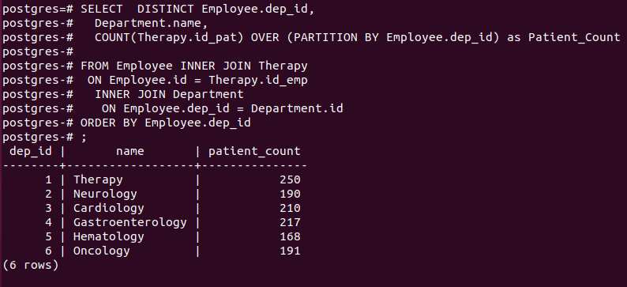
  

